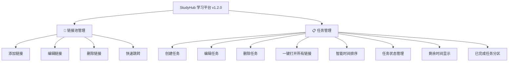

# StudyHub - 学习智能体平台

一个基于浏览器的轻量级学习任务管理工具，帮助你高效管理学习链接和任务计划。

[](https://opensource.org/licenses/MIT)
[](https://github.com/chb/StudyHub)
[](https://github.com/chb/StudyHub)

## 📖 项目简介

StudyHub 是一个前端单页应用，提供简洁直观的界面来管理学习资源链接和学习任务。无需后端服务器，所有数据本地存储，开箱即用。

### ✨ 主要特性

- 🔗 **链接池管理** - 快速添加、编辑、删除常用学习链接，支持一键跳转
- 📋 **任务管理** - 创建学习任务，设置截止时间，关联多个链接
- ⏰ **智能排序** - 任务按截止时间自动排序，紧急任务高亮显示
- ✅ **任务状态** - 标记任务完成状态，已完成任务自动归档分区
- ⏱️ **时间提醒** - 动态显示剩余时间，逾期任务持续提醒
- 🔔 **通知系统** - Toast 消息提示，确认型对话框，友好的交互体验
- ✅ **表单校验** - URL 实时验证，必填项即时提示，截止时间智能检查
- 🚀 **一键跳转** - 批量打开任务相关的所有学习链接
- 💾 **本地存储** - 使用 localStorage 持久化数据，隐私安全
- 🎨 **现代 UI** - 简洁美观的卡片式设计，响应式布局，流畅动画

## 🚀 快速开始

### 方式一：直接使用

1. 下载 `studyhub.html` 文件
2. 用浏览器（推荐 Chrome/Edge）打开
3. 开始使用！

### 方式二：本地部署

```bash
# 克隆项目到本地
git clone https://github.com/your-username/StudyHub.git

# 进入项目目录
cd StudyHub

# 直接用浏览器打开 studyhub.html
# 或者启动本地服务器
python -m http.server 8080
```

然后在浏览器访问 `http://localhost:8080/studyhub.html`

## 📖 使用指南

### 1️⃣ 管理链接池

在"快速链接池"模块中：
- 输入链接名称和 URL
- 点击"添加链接"按钮
- 可点击已有链接快速跳转
- 支持编辑和删除操作

### 2️⃣ 创建任务

在"任务管理"模块中：
- 输入任务名称
- 选择截止日期和时间
- 从链接池勾选或手动输入相关链接
- 点击"创建任务"

### 3️⃣ 执行任务

- 查看按时间排序的任务列表
- 点击"一键跳转"批量打开所有学习链接
- 支持随时编辑或删除任务

## 🛠️ 技术栈

- **纯前端实现** - HTML5 + CSS3 + JavaScript
- **本地存储** - localStorage API
- **零依赖** - 无需任何第三方库
- **响应式设计** - 适配各种屏幕尺寸

## 📁 项目结构

```
StudyHub/
├── docs/                    # 项目文档
│   ├── roadmap.md          # 发展规划
│   └── changelog.md        # 更新日志
├── legacy/                  # 旧版本代码（保留）
│   └── studyhub.html
├── studyhub.html           # 当前版本（v1.0）
└── README.md               # 项目说明
```

## 🎯 功能树



## 🔧 自定义配置

### 修改主题颜色

编辑 `studyhub.html` 中的 CSS 部分：

```css
/* 修改主色调 */
button {
    background: #4f8cff;  /* 改为你喜欢的颜色 */
}

/* 修改背景色 */
body {
    background: #f5f7fa;  /* 改为其他背景色 */
}
```

### 添加新功能

项目采用模块化设计，易于扩展：
- 在 `<style>` 标签中添加新样式
- 在 `<script>` 标签中添加新函数
- 在 `<body>` 中添加新的 HTML 元素

## 🤝 贡献指南

欢迎提交 Issue 和 Pull Request！

1. Fork 本项目
2. 创建特性分支 (`git checkout -b feature/AmazingFeature`)
3. 提交更改 (`git commit -m 'Add some AmazingFeature'`)
4. 推送到分支 (`git push origin feature/AmazingFeature`)
5. 开启 Pull Request

## 📄 开源协议

MIT License - 详见 [LICENSE](LICENSE) 文件

## 🐛 问题反馈

如遇到问题，请前往 [Issues](https://github.com/your-username/StudyHub/issues) 页面反馈。

## 📬 联系方式

- 作者：chb
- Email: 2956529037@qq.com

## 📊 当前版本

**最新版本：v1.2.0**（2026-03-19）

**核心功能：**
- ✅ 完整的链接池管理系统
- ✅ 任务创建、编辑、删除功能
- ✅ 任务完成状态标记与分区显示
- ✅ 智能时间排序与提醒
- ✅ Toast 通知系统与确认对话框
- ✅ 实时表单验证与错误提示
- ✅ 本地数据持久化存储
- ✅ 响应式卡片式设计

**下一版本预告（v1.3.0）：**
- 交互细节优化（批量打开进度提示、URL 复制）
- 可访问性改进（焦点管理、键盘导航）
- 移动端适配增强

更多规划详见 [开发路线图](docs/roadmap.md)

## 🙏 致谢

感谢所有为本项目做出贡献的开发者！

---

**Enjoy Learning! 🎓**

> 💡 **提示：** 本项目正在从纯前端版本向全栈版本演进。如果你对项目发展有任何建议，欢迎在 Issues 中提出！
