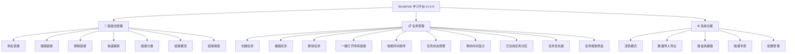

# StudyHub - 学习智能体平台

一个基于浏览器的轻量级学习任务管理工具，帮助你高效管理学习链接和任务计划。

[](https://opensource.org/licenses/MIT)
[](https://github.com/chb/StudyHub)
[](https://github.com/chb/StudyHub)

## 📖 项目简介

StudyHub 是一个前端单页应用，提供简洁直观的界面来管理学习资源链接和学习任务。无需后端服务器，所有数据本地存储，开箱即用。

### ✨ 主要特性

- 🔗 **链接池管理** - 快速添加、编辑、删除常用学习链接，支持一键跳转
- 🏷️ **链接分类** - 支持自定义分类，颜色标识，分类筛选
- 📌 **链接置顶** - 常用链接置顶显示，金色边框高亮
- 📋 **任务管理** - 创建学习任务，设置截止时间，关联多个链接
- 🎯 **任务优先级** - 高/中/低优先级设置，按优先级排序
- ⏰ **智能排序** - 任务按截止时间自动排序，紧急任务高亮显示
- ✅ **任务状态** - 标记任务完成状态，已完成任务自动归档分区
- ⏱️ **时间提醒** - 动态显示剩余时间，逾期任务持续提醒
- 🔔 **通知系统** - Toast 消息提示，确认型对话框，友好的交互体验
- ✅ **表单校验** - URL 实时验证，必填项即时提示，截止时间智能检查
- 🚀 **一键跳转** - 批量打开任务相关的所有学习链接
- 💾 **本地存储** - 使用 localStorage 持久化数据，隐私安全
- 📊 **数据导入导出** - JSON 格式备份和恢复数据
- 🌓 **深色模式** - 支持浅色/深色/跟随系统主题
- ⌨️ **键盘快捷键** - 完整的快捷键支持，提升操作效率
- 📱 **移动端适配** - 触摸手势支持，响应式布局
- 🎨 **现代 UI** - 简洁美观的卡片式设计，流畅动画

## 🚀 快速开始

### 方式一：直接使用

1. 下载项目文件
2. 用浏览器（推荐 Chrome/Edge）打开根目录的 `index.html`
3. 开始使用！

### 方式二：本地服务器（推荐）

```bash
# 克隆项目到本地
git clone https://github.com/your-username/StudyHub.git

# 进入项目目录
cd StudyHub

# 启动前端开发服务器（需要 Python 3）
npm run dev
# 或者：python -m http.server 8080
```

然后在浏览器访问 `http://localhost:8080`

### 方式三：仅运行前端（等效于方式二）

```bash
# 直接托管 frontend/ 目录
python -m http.server 8080 --directory frontend
```

访问 `http://localhost:8080`

## 📖 使用指南

### 1️⃣ 管理链接池

在"快速链接池"模块中：
- 输入链接名称和 URL
- 点击"添加链接"按钮
- 可点击已有链接快速跳转
- 支持编辑和删除操作

### 2️⃣ 创建任务

在"任务管理"模块中：
- 输入任务名称
- 选择截止日期和时间
- 从链接池勾选或手动输入相关链接
- 点击"创建任务"

### 3️⃣ 执行任务

- 查看按时间排序的任务列表
- 点击"一键跳转"批量打开所有学习链接
- 支持随时编辑或删除任务

## 🛠️ 技术栈

- **纯前端实现** - HTML5 + CSS3 + JavaScript
- **本地存储** - localStorage API
- **零依赖** - 无需任何第三方库
- **响应式设计** - 适配各种屏幕尺寸

## 📁 项目结构

```
StudyHub/
├── docs/                       # 项目文档
│   ├── roadmap.md             # 发展规划
│   └── changelog.md           # 更新日志
├── src/                        # 源代码
│   ├── css/
│   │   └── main.css           # 主样式文件
│   └── js/
│       ├── modules/           # 功能模块
│       │   ├── config.js      # 配置中心
│       │   ├── utils.js       # 工具函数
│       │   ├── storage.js     # 存储管理
│       │   ├── errorHandler.js # 错误处理
│       │   ├── toast.js       # 通知系统
│       │   ├── modal.js       # 模态框
│       │   ├── theme.js       # 主题管理
│       │   ├── keyboard.js    # 键盘快捷键
│       │   ├── touch.js       # 触摸操作
│       │   ├── linkManager.js # 链接管理
│       │   ├── taskManager.js # 任务管理
│       │   └── renderer.js    # UI渲染
│       └── app.js             # 主应用入口
├── index.html                 # 主页面（v1.4.0）
├── studyhub.html              # 旧版本（v1.3.x）
└── README.md                  # 项目说明
```

## 🎯 功能树



## ⌨️ 快捷键

| 快捷键 | 功能 |
|--------|------|
| `N` | 新建链接 |
| `T` | 新建任务 |
| `/` | 聚焦搜索框 |
| `Ctrl+D` | 切换深色/浅色主题 |
| `Ctrl+E` | 导出数据 |
| `Ctrl+I` | 导入数据 |
| `↑/↓` | 列表项导航 |
| `Enter` | 打开链接/一键跳转 |
| `Delete` | 删除当前项 |
| `Esc` | 关闭模态框 |

## 🔧 自定义配置

### 修改主题颜色

编辑 `frontend/src/css/main.css` 中的 CSS 变量部分：

```css
:root {
    --primary-color: #4f8cff;  /* 改为你喜欢的颜色 */
    --bg-primary: #f5f7fa;     /* 改为其他背景色 */
}
```

### 添加新功能

项目采用模块化设计，易于扩展：
- 在 `frontend/src/js/modules/` 中添加新模块
- 在 `frontend/src/css/main.css` 中添加新样式
- 在 `frontend/index.html` 中引入新模块

## 🏗️ 项目结构（v2.0-dev）

```
StudyHub/
├── frontend/               # 前端代码（从 src/ 迁移）
│   ├── src/
│   │   ├── css/
│   │   │   └── main.css    # 主样式文件
│   │   └── js/
│   │       ├── modules/
│   │       │   ├── storage/
│   │       │   │   ├── AbstractStorage.js    # 存储抽象接口
│   │       │   │   └── LocalStorageAdapter.js# localStorage 实现
│   │       │   ├── storage.js  # 存储工厂（选择适配器）
│   │       │   ├── config.js   # 配置中心
│   │       │   └── ...         # 其他功能模块
│   │       └── app.js          # 应用入口
│   ├── index.html              # 主页面
│   └── studyhub.html           # 旧版本（备用）
├── backend/                # 后端服务（Phase 1 实现）
│   ├── src/
│   │   ├── index.js        # Express 入口
│   │   └── routes/
│   │       └── health.js   # 健康检查
│   ├── package.json
│   └── .env.example        # 环境变量模板
├── shared/                 # 前后端共享
│   └── types.js            # JSDoc 类型定义
├── index.html              # 根级入口（引用 frontend/）
└── package.json            # 根级开发脚本
```

## 🛠️ 开发者指引（v2.0-dev）

### 前端开发

```bash
# 启动前端开发服务器
npm run dev
# 访问 http://localhost:8080

# 或直接在浏览器中打开 index.html / frontend/index.html
```

### 后端开发（Phase 1 后可用）

```bash
# 安装后端依赖
npm run install:deps

# 配置环境变量
cd backend
copy .env.example .env  # Windows
# cp .env.example .env  # Mac/Linux

# 启动后端开发服务器
npm run dev:backend
# 访问 http://localhost:3000/api/health
```

### 启用后端同步（Phase 1 实现后）

在浏览器控制台执行：
```javascript
Config.set('features.backendSync', true);
location.reload();
```

### 架构决策记录（ADR）

**ADR-001：存储抽象层设计（Phase 0，2026-03-20）**

**背景**：为实现渐进式前后端分离，需要在不影响现有功能的前提下解耦存储实现。

**决策**：
- 引入 `AbstractStorage` 基类定义存储接口规范（`get/set/remove/clear`）
- `LocalStorageAdapter` 继承基类，保持现有 localStorage 行为
- `Storage` 模块重构为工厂，通过 `Config.get('features.backendSync')` 动态选择适配器
- Phase 1 实现 `BackendAdapter`（HTTP API）后，只需修改工厂即可切换，上层代码零改动

**影响**：所有业务模块（LinkManager、TaskManager 等）继续使用 `Storage.*`，无需修改。

## 🤝 贡献指南

欢迎提交 Issue 和 Pull Request！

1. Fork 本项目
2. 创建特性分支 (`git checkout -b feature/AmazingFeature`)
3. 提交更改 (`git commit -m 'Add some AmazingFeature'`)
4. 推送到分支 (`git push origin feature/AmazingFeature`)
5. 开启 Pull Request

## 📄 开源协议

MIT License - 详见 [LICENSE](LICENSE) 文件

## 🐛 问题反馈

如遇到问题，请前往 [Issues](https://github.com/your-username/StudyHub/issues) 页面反馈。

## 📬 联系方式

- 作者：chb
- Email: 2956529037@qq.com

## 📊 当前版本

**最新版本：v2.0.0**（2026-03-23）

**核心功能：**
- 完整的链接池管理系统（分类、置顶、搜索）
- 任务创建、编辑、删除功能
- 任务优先级设置（高/中/低）
- 任务完成状态标记与分区显示
- 智能时间排序与提醒
- Toast 通知系统与确认对话框
- 实时表单验证与错误提示
- 本地数据持久化存储
- 数据导入导出功能（JSON格式）
- 深色模式支持（浅色/深色/跟随系统）
- 键盘快捷键支持
- 移动端触摸手势支持
- 模块化架构设计
- 响应式卡片式设计

**v2.0.0 新特性：**
- 后端 API 集成（Express + TypeScript）
- PostgreSQL 数据库存储
- Redis 缓存与会话管理
- 用户认证系统（JWT + Refresh Token）
- 数据云同步
- Docker 容器化部署
- 安全防护（SQL注入/XSS/CSRF防护）
- 加载状态与网络错误友好提示
- 操作撤销功能

更多规划详见 [开发路线图](docs/roadmap.md)

## 🙏 致谢

感谢所有为本项目做出贡献的开发者！

---

**Enjoy Learning! 🎓**

> 💡 **提示：** 本项目正在从纯前端版本向全栈版本演进。如果你对项目发展有任何建议，欢迎在 Issues 中提出！
