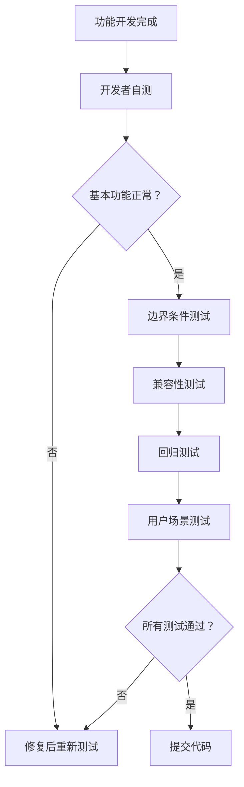
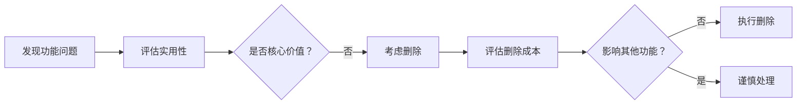
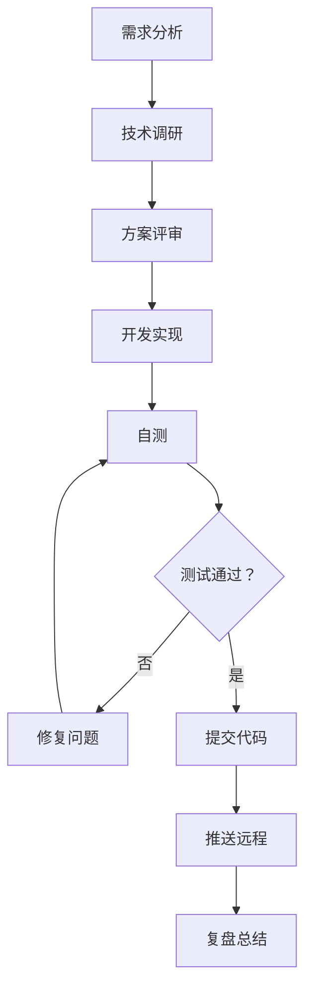

# 开发经验与最佳实践

> 本文档记录了 StudyHub 项目开发过程中的核心经验教训、技术决策和最佳实践，旨在形成可复用的技术资产。

---

## 📋 目录

1. [版本控制管理](#1-版本控制管理)
2. [测试与质量保证](#2-测试与质量保证)
3. [Git 技能树](#3-git-技能树)
4. [开发方向把控](#4-开发方向把控)
5. [技术决策方法论](#5-技术决策方法论)
6. [开发注意事项清单](#6-开发注意事项清单)
7. [核心原则总结](#7-核心原则总结)

---

## 1. 版本控制管理

### 1.1 及时提交的重要性

#### ❌ 反面案例
在本次开发中遇到的问题：
- **问题发现滞后**：修复"一键跳转多链接"bug 后，连续进行了多次修改才统一提交
- **回滚成本高**：当发现新版本不如预期时，需要仔细甄别哪些提交需要保留
- **上下文丢失**：多个功能混在一个提交中，难以追溯每个功能的实现细节

#### ✅ 最佳实践

**原则：小步快跑，及时固化**

```bash
# 完成一个小功能点后立即提交
git add <files>
git commit -m "feat: 功能描述"

# 继续下一个功能点...
```

**提交粒度建议：**
| 变更类型 | 建议粒度 | 示例 |
|---------|---------|------|
| ✨ 新功能 | 单个功能点 | `feat: 添加 Toast 通知系统` |
| 🐛 Bug 修复 | 单个问题 | `fix: 修复一键跳转只打开第一个链接的 bug` |
| ♻️ 重构 | 单个模块 | `refactor: 重构数据管理模块` |
| 🗑️ 删除功能 | 完整移除 | `remove: 彻底移除数据导入导出功能` |

**时间窗口：**
- ⏰ **功能完成后立即提交**（不超过 30 分钟）
- ⏰ **遇到阻塞性问题前先提交**（当前状态可工作）
- ⏰ **每天下班前必须提交**（即使功能未完成）

### 1.2 Push 的时机与策略

#### 风险场景
```
本地有 3 个未推送的提交
└─> 硬盘损坏/代码冲突/误操作
    └─> 所有更改丢失 ❌
```

#### Push 策略

| 场景 | 操作 | 频率 |
|------|------|------|
| 完成重要功能 | `git push origin main` | 立即 |
| 阶段性成果 | `git push` | 每 2-3 个 commit |
| 每日结束 | `git push` | 强制要求 |
| 分支切换前 | `git push` | 必须 |

**命令示例：**
```bash
# 查看未推送的提交
git log --oneline origin/main..main

# 推送到远程
git push origin main

# 查看远程状态
git status -sb
```

---

## 2. 测试与质量保证

### 2.1 测试的层次与覆盖

#### 完整测试流程



#### 测试清单（Checklist）

**基础功能测试：**
- [ ] 核心功能是否按预期工作
- [ ] 表单验证是否生效
- [ ] 数据持久化是否正常
- [ ] UI 渲染是否正确

**边界条件测试：**
- [ ] 空数据情况（0 条记录）
- [ ] 大数据量（100+ 条）
- [ ] 极端值（超长文本、特殊字符）
- [ ] 网络异常（如果是全栈）

**兼容性测试：**
- [ ] Chrome/Edge/Firefox 浏览器
- [ ] 不同分辨率（1920x1080, 1366x768, 移动端）
- [ ] 深色模式（如果支持）

**回归测试：**
- [ ] 新功能是**否破坏了旧功能**
- [ ] 关联功能是否受影响
- [ ] 性能是否有明显下降

### 2.2 避免"修复一个问题又引入新问题"

#### 案例分析

**问题链：**
```
原始问题：一键跳转只能打开第一个链接
   ↓
修复方案 1：使用 setTimeout 延迟打开
   ↓
新问题：被浏览器拦截（失去用户手势上下文）
   ↓
修复方案 2：同步循环 + 唯一 target
   ↓
新问题：超过 5 个链接如何处理
   ↓
修复方案 3：确认对话框 + 备选方案
   ↓
最终发现：浏览器白名单机制更简单
   ↓
决策：回退到简洁版本
```

**教训：**
1. **没有充分理解浏览器机制**就匆忙写代码
2. **缺少全面的场景测试**（只测试了 2-3 个链接）
3. **没有调研现有解决方案**（白名单机制）

#### 预防措施

**1. 需求分析阶段**
```markdown
## 需求澄清清单
- [ ] 这个功能的用户使用场景是什么？
- [ ] 有哪些边界情况需要考虑？
- [ ] 是否有现成的 API 或机制可以利用？
- [ ] 业界最佳实践是什么？
```

**2. 技术方案评审**
```markdown
## 方案对比表
| 方案 | 优点 | 缺点 | 复杂度 | 推荐度 |
|------|------|------|--------|--------|
| setTimeout 延迟 | 简单 | 被拦截 | ⭐ |  |
| 同步循环 +target | 可靠 | 数量有限制 | ⭐⭐ | ✅ |
| 白名单机制 | 最彻底 | 需用户操作 | ⭐ | ✅✅ |
```

**3. 测试用例设计**
```javascript
// 测试矩阵
const testCases = [
  { links: 1, expected: '全部打开' },
  { links: 3, expected: '全部打开' },
  { links: 5, expected: '全部打开' },
  { links: 8, expected: '部分打开 + 提示' },
  { links: 15, expected: '引导使用备选方案' }
];
```

### 2.3 版本保留策略

**决策流程：**
```
完成测试
   ↓
评估价值
   ├─> 功能实用 + 代码简洁 → 保留 ✅
   ├─> 功能实用 + 代码复杂 → 优化后保留 ⚠️
   ├─> 功能冗余 + 代码复杂 → 删除 ❌
   └─> 功能冗余 + 代码简洁 → 可选保留 🤔
      ↓
执行决策
   ├─> 保留：git commit
   ├─> 优化：git reset --soft HEAD~1
   └─> 删除：git reset --hard HEAD~1
```

---

## 3. Git 技能树

### 3.1 分支管理策略

#### 单分支开发（适合个人项目）
```bash
# 主分支：main（始终保持可运行状态）
# 开发流程：
git checkout main              # 切换到主分支
git pull origin main           # 拉取最新代码
git checkout -b feature/new    # 创建特性分支
# ... 开发功能 ...
git checkout main              # 切回主分支
git merge feature/new          # 合并特性
git push origin main           # 推送远程
git branch -d feature/new      # 删除特性分支
```

#### 多分支协作（适合团队）
```bash
# 分支命名规范
main          # 生产环境
develop       # 开发分支
feature/*     # 功能分支
bugfix/*      # Bug 修复分支
hotfix/*      # 紧急修复分支
```

### 3.2 版本回退技巧

#### 场景 1：临时查看历史版本
```bash
# 查看提交历史
git log --oneline -10

# 切换到指定版本（游离头状态）
git checkout 870552c

# 测试完成后返回主分支
git checkout main
```

⚠️ **注意**：此状态下不要直接修改代码，否则切换回来会丢失！

#### 场景 2：基于历史版本开发
```bash
# 创建新分支保护进度
git checkout -b backup-latest-version  # 先备份当前版本
git checkout 870552c                    # 切换到目标版本
git checkout -b feature/old-based       # 基于此创建新分支
```

#### 场景 3：彻底回退（丢弃后续提交）
```bash
# 硬回退到指定版本（危险操作！）
git reset --hard 870552c

# 回退前务必备份！
git branch backup-before-reset
```

#### 场景 4：撤销最近一次提交（保留修改）
```bash
# 软回退（保留工作区修改）
git reset --soft HEAD~1

# 混合回退（保留修改但取消暂存）
git reset HEAD~1
```

### 3.3 提交信息管理

#### Commit Message 规范
```bash
# 格式：<type>: <subject>

# Type 类型
feat:     新功能
fix:      Bug 修复
docs:     文档更新
style:    代码格式（不影响功能）
refactor: 重构
test:     测试相关
chore:    构建工具/依赖管理

# 示例
feat: 添加 Toast 通知系统
fix: 修复一键跳转只打开第一个链接的 bug
docs: 更新 README 安装说明
refactor: 重构数据管理模块为独立函数
```

#### 有用的 Git 命令
```bash
# 查看提交历史（美化输出）
git log --oneline --graph --all

# 查看某个文件的修改历史
git log --follow studyhub.html

# 比较两个版本的差异
git diff 926b3dc 1c4ee00

# 查看谁在什么时候修改了什么
git blame studyhub.html

# 撤销工作区修改（未 git add）
git checkout -- <file>

# 撤销已暂存的修改（已 git add）
git reset HEAD <file>
```

### 3.4 冲突解决

#### 预防冲突
```bash
# 开始工作前
git pull origin main

# 定期同步远程代码
git fetch origin
git rebase origin/main
```

#### 解决冲突步骤
```bash
# 1. 发生冲突时
CONFLICT (content): Merge conflict in studyhub.html

# 2. 打开文件，找到冲突标记
<<<<<<< HEAD
你的修改
=======
别人的修改
>>>>>>> branch-name

# 3. 手动选择保留的代码，删除标记

# 4. 标记为解决
git add studyhub.html

# 5. 完成合并
git commit
```

---

## 4. 开发方向把控

### 4.1 识别冗余功能

#### 冗余特征清单
如果一个功能符合以下**任意 2 条**，就需要警惕：

- [ ] **低频使用**：用户可能一个月都用不到一次
- [ ] **实现复杂**：需要大量代码才能完成
- [ ] **替代方案**：有更简单的实现方式
- [ ] **偏离主线**：与核心功能关联度低
- [ ] **过度设计**：考虑了太多未来可能的需求

#### 实际案例：数据导入导出功能

**为什么是冗余的？**
```
❌ 低频使用：用户很少需要备份/恢复数据
❌ 实现复杂：需要 13 个函数 + 大量 UI 代码
❌ 替代方案：浏览器本地存储已足够稳定
❌ 偏离主线：StudyHub 核心是学习管理，不是数据管理
❌ 用户体验：导入导出对小白用户门槛高
```

**决策过程：**


**删除检查清单：**
- [ ] CSS 样式完全清除
- [ ] HTML 元素完全删除
- [ ] JavaScript 函数全部移除
- [ ] 变量和常量清理
- [ ] 初始化调用删除
- [ ] 文档同步更新
- [ ] grep 搜索无残留

### 4.2 需求过滤框架

#### RICE 评分模型
```
R - Reach（覆盖范围）：多少用户会使用？
I - Impact（影响力）：对用户帮助有多大？
C - Confidence（信心度）：有多少把握？
E - Effort（工作量）：需要多少开发成本？

评分 = (R × I × C) / E
```

**应用示例：一键跳转优化**

| 方案 | R(1-10) | I(1-10) | C(0-1) | E(人天) | 得分 |
|------|---------|---------|--------|---------|------|
| 同步循环 +target | 8 | 7 | 0.9 | 0.5 | **100.8** |
| 异步队列 + 进度条 | 6 | 6 | 0.6 | 2 | **10.8** |
| 白名单引导 | 9 | 8 | 0.8 | 0.3 | **192** ✅ |

结论：**优先实现白名单引导**，次选同步循环方案。

### 4.3 技术债管理

#### 技术债识别
```javascript
// 代码异味（Code Smell）示例

// ❌ 坏味道：过长的函数
function handleEverything() {
  // 200 行代码...
}

// ✅ 好代码：职责单一
function validateData() { /* ... */ }
function saveData() { /* ... */ }
function renderUI() { /* ... */ }

// ❌ 坏味道：魔法数字
setTimeout(() => {}, 100);

// ✅ 好代码：具名常量
const RETRY_DELAY_MS = 100;
```

#### 还债计划
| 债务类型 | 优先级 | 计划版本 |
|---------|--------|----------|
| XSS 防护缺失 | 🔴 高 | v1.1.0 ✅ |
| 内联 JS 事件 | 🟡 中 | v1.4.0 |
| 全局变量污染 | 🟡 中 | v1.4.0 |
| 缺少类型注释 | 🟢 低 | v1.4.0 |

---

## 5. 技术决策方法论

### 5.1 决策框架

#### 四象限法则
```
            高价值
              ↑
    优先做    │    规划做
    ──────    │    ──────
    立即执行  │    排期执行
──────────────┼──────────────→ 影响力
    避免做    │    谨慎做
    ──────    │    ──────
    直接拒绝  │    评估风险
              │
            低价值
         ←────────────→
          低成本    高成本
```

**应用示例：**

| 功能 | 价值 | 成本 | 决策 |
|------|------|------|------|
| Toast 通知 | 高 | 低 | ✅ 立即做 |
| 拖拽排序 | 中 | 高 | 📅 规划做 |
| 数据导入导出 | 低 | 高 | ❌ 避免做 |
| 全局快捷键 | 中 | 低 | ⚠️ 谨慎评估 |

### 5.2 技术调研清单

在决定实现一个功能前，先回答这些问题：

```markdown
## 功能调研清单

### 用户需求
- [ ] 这个功能解决了什么痛点？
- [ ] 目标用户是谁？使用频率如何？
- [ ] 有没有用户明确提过这个需求？

### 技术方案
- [ ] 业界标准实现是什么？
- [ ] 有哪些现成的库可以用？
- [ ] 浏览器原生支持情况如何？
- [ ] 有没有更简单的替代方案？

### 成本评估
- [ ] 开发需要多少人天？
- [ ] 测试复杂度如何？
- [ ] 维护成本多大？
- [ ] 对现有代码影响范围？

### 风险评估
- [ ] 有什么技术难点？
- [ ] 有什么安全隐患？
- [ ] 性能会不会下降？
- [ ] 兼容性有没有问题？

### 验收标准
- [ ] 如何定义功能完成？
- [ ] 需要哪些测试用例？
- [ ] 性能指标是什么？
- [ ] 用户体验标准？
```

### 5.3 复盘模板

```markdown
## 功能复盘报告

### 基本信息
- 功能名称：
- 开发日期：
- 开发人员：
- 耗时：

### 目标回顾
- 最初目标：
- 预期效果：
- 验收标准：

### 实际结果
- 完成情况：
- 用户反馈：
- 发现问题：

### 经验教训
✅ 做得好的：
1. 
2. 

❌ 需要改进的：
1. 
2. 

💡 下次可以优化的：
1. 
2. 

### 行动项
- [ ] 待优化事项 1
- [ ] 待补充测试
- [ ] 待更新文档
```

---

## 6. 开发注意事项清单

### 6.1 开发流程注意事项

1. **切换会话防止记忆导致差的效果**
   - 长时间对话会导致 AI 上下文记忆混乱，适时新建对话

2. **搞清楚当前架构状态，要清晰**
   - 开发前先了解项目整体结构和当前状态

3. **要有日志，方便查找问题所在**
   - 关键操作添加日志记录，便于问题定位

4. **F12 是要注意有没有搜索和筛选**
   - 善用浏览器开发者工具的搜索和筛选功能

5. **要让 AI 读代码，而不是靠上下文**
   - 解决不了问题时，最好重新开一个对话，让 AI 重新读取代码

6. **一开始就定好目标，不要东加一点西加一点**
   - 明确功能目标，避免渐进式开发导致代码混乱

### 6.2 上下文管理

7. **要给 AI 上下文信息，最好放在文件里**
   - 在某个阶段提供某个阶段的上下文信息，便于 AI 理解

8. **每个功能都要自己检查**
   - 当时的偷懒会给以后带来很多麻烦

9. **本地数据库表结构和服务器的数据库表结构要同步**
   - 不同步会造成很多麻烦

### 6.3 开发策略

10. **开发要单一，渐进式开发并不好**
    - 要明确目标，不然代码混在一起，出问题不好排查

11. **用高效的模型，为以后节约时间**
    - 最好是利用最强的模型写好所有的规划和细节，然后照着开发

12. **每次开发之前要了解代码，了解上下文**
    - 不要直接开始写代码，先理解现有代码

### 6.4 工具使用

13. **要配合好 F12 开发者工具**
    - 调试、网络请求、性能分析都离不开开发者工具

14. **不同的操作系统有不同的命令**
    - Windows PowerShell 和 Linux/Mac 的命令有差异，注意区分

---

## 7. 核心原则总结

### 7.1 七大原则

1. **版本控制要及时** - 小步快跑，及时固化，每日 push
2. **测试要充分** - 基础→边界→兼容→回归，四层测试缺一不可
3. **Git 是利器** - 善用分支、回退、比对，但不要滥用
4. **方向比速度重要** - 先想清楚再动手，避免过度设计
5. **简单优于复杂** - 如果有简单的解决方案，就不要选择复杂的
6. **用户价值导向** - 低频、高成本、偏离核心的功能要敢于说不
7. **持续复盘** - 每个重要功能完成后都要总结经验教训

### 7.2 开发流程图



---

**文档版本**: v1.0  
**最后更新**: 2026-03-19  
**作者**: chb  
**联系邮箱**: 2956529037@qq.com
